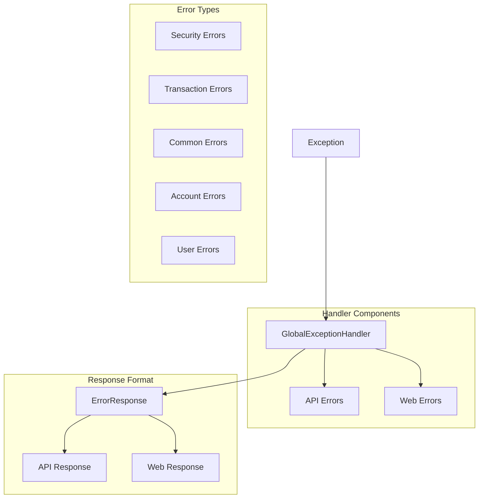

# Simplified Exception Handler System

## Overview

A streamlined approach to handling exceptions across the BankApp application, focusing on simplicity and maintainability while covering all necessary error scenarios.



## Core Components

### 1. ApiError Enum
```java
public enum ApiError {
    // Common Errors
    VALIDATION_ERROR(HttpStatus.BAD_REQUEST, "Invalid input data"),
    RESOURCE_NOT_FOUND(HttpStatus.NOT_FOUND, "Resource not found"),
    INTERNAL_ERROR(HttpStatus.INTERNAL_SERVER_ERROR, "Internal server error"),
    
    // Security Errors
    TOKEN_EXPIRED(HttpStatus.BAD_REQUEST, "Password reset link has expired"),
    TOKEN_INVALID(HttpStatus.BAD_REQUEST, "Invalid password reset link"),
    TOKEN_USED(HttpStatus.BAD_REQUEST, "Password reset link has already been used"),
    INVALID_CREDENTIALS(HttpStatus.UNAUTHORIZED, "Invalid credentials"),
    
    // Transaction Errors
    INSUFFICIENT_FUNDS(HttpStatus.FORBIDDEN, "Insufficient funds for this transaction"),
    TRANSACTION_FAILED(HttpStatus.BAD_REQUEST, "Transaction could not be processed"),
    INVALID_TRANSACTION(HttpStatus.BAD_REQUEST, "Invalid transaction details"),
    
    // Account Errors
    ACCOUNT_LOCKED(HttpStatus.FORBIDDEN, "Account is currently locked"),
    ACCOUNT_NOT_FOUND(HttpStatus.NOT_FOUND, "Account not found"),
    INVALID_ACCOUNT_STATE(HttpStatus.BAD_REQUEST, "Invalid account state for this operation"),
    
    // User Errors
    USER_NOT_FOUND(HttpStatus.NOT_FOUND, "User not found"),
    USER_ALREADY_EXISTS(HttpStatus.CONFLICT, "User already exists"),
    INVALID_USER_STATE(HttpStatus.BAD_REQUEST, "Invalid user state for this operation");

    private final HttpStatus status;
    private final String message;

    ApiError(HttpStatus status, String message) {
        this.status = status;
        this.message = message;
    }

    // Standard getters
    public HttpStatus getStatus() { return status; }
    public String getMessage() { return message; }
}
```

### 2. Error Response DTO
```java
@Getter
@Builder
public class ErrorResponse {
    private final String code;          // Error code (e.g., "USER_NOT_FOUND")
    private final String message;       // User-friendly error message
    private final LocalDateTime timestamp;
    private final String path;          // Request URI
    private final Map<String, Object> details; // Optional additional error details
}
```

### 3. Global Exception Handler
```java
@RestControllerAdvice
@Slf4j
public class GlobalExceptionHandler {
    
    @ExceptionHandler(Exception.class)
    public ResponseEntity<ErrorResponse> handleException(Exception ex, WebRequest request) {
        ApiError error = mapExceptionToError(ex);
        String path = ((ServletWebRequest) request).getRequest().getRequestURI();
        
        ErrorResponse response = ErrorResponse.builder()
            .code(error.name())
            .message(error.getMessage())
            .timestamp(LocalDateTime.now())
            .path(path)
            .details(getErrorDetails(ex))
            .build();
            
        logError(error, ex, path);
        return new ResponseEntity<>(response, error.getStatus());
    }
    
    private ApiError mapExceptionToError(Exception ex) {
        return switch (ex) {
            // Security Exceptions
            case TokenExpiredException e -> ApiError.TOKEN_EXPIRED;
            case InvalidTokenException e -> ApiError.TOKEN_INVALID;
            case UsedTokenException e -> ApiError.TOKEN_USED;
            case BadCredentialsException e -> ApiError.INVALID_CREDENTIALS;
            
            // Transaction Exceptions
            case InsufficientFundsException e -> ApiError.INSUFFICIENT_FUNDS;
            case TransactionFailedException e -> ApiError.TRANSACTION_FAILED;
            case InvalidTransactionException e -> ApiError.INVALID_TRANSACTION;
            
            // Account Exceptions
            case AccountLockedException e -> ApiError.ACCOUNT_LOCKED;
            case AccountNotFoundException e -> ApiError.ACCOUNT_NOT_FOUND;
            case InvalidAccountStateException e -> ApiError.INVALID_ACCOUNT_STATE;
            
            // User Exceptions
            case UserNotFoundException e -> ApiError.USER_NOT_FOUND;
            case UserAlreadyExistsException e -> ApiError.USER_ALREADY_EXISTS;
            case InvalidUserStateException e -> ApiError.INVALID_USER_STATE;
            
            // Validation Exceptions
            case MethodArgumentNotValidException e -> ApiError.VALIDATION_ERROR;
            case ConstraintViolationException e -> ApiError.VALIDATION_ERROR;
            
            // Fallback
            default -> ApiError.INTERNAL_ERROR;
        };
    }
    
    private Map<String, Object> getErrorDetails(Exception ex) {
        Map<String, Object> details = new HashMap<>();
        
        if (ex instanceof MethodArgumentNotValidException validationEx) {
            details.put("validationErrors", validationEx.getBindingResult()
                .getFieldErrors()
                .stream()
                .map(err -> Map.of(
                    "field", err.getField(),
                    "message", err.getDefaultMessage()
                ))
                .toList());
        }
        
        return details;
    }
    
    private void logError(ApiError error, Exception ex, String path) {
        String message = String.format(
            "Error occurred: %s, Path: %s, Message: %s",
            error.name(),
            path,
            ex.getMessage()
        );
        
        if (error == ApiError.INTERNAL_ERROR) {
            log.error(message, ex);
        } else {
            log.warn(message);
        }
    }
}
```

### 4. Web Error Handler Extension
```java
@ControllerAdvice(basePackages = "info.mackiewicz.bankapp.presentation")
@Slf4j
public class WebErrorHandler extends GlobalExceptionHandler {
    
    @ExceptionHandler(Exception.class)
    public ModelAndView handleWebException(Exception ex, HttpServletRequest request) {
        ErrorResponse error = super.handleException(ex, request).getBody();
        
        ModelAndView mav = new ModelAndView("error");
        mav.addObject("error", error);
        mav.addObject("showHome", shouldShowHomeButton(error.getCode()));
        return mav;
    }
    
    private boolean shouldShowHomeButton(String errorCode) {
        return !Arrays.asList(
            ApiError.INVALID_CREDENTIALS.name(),
            ApiError.TOKEN_INVALID.name(),
            ApiError.TOKEN_EXPIRED.name()
        ).contains(errorCode);
    }
}
```

## Testing Strategy

### 1. Unit Tests
```java
@ExtendWith(MockitoExtension.class)
class GlobalExceptionHandlerTest {
    
    @InjectMocks
    private GlobalExceptionHandler handler;
    
    @Test
    void shouldHandleSecurityExceptions() {
        // Given
        TokenExpiredException ex = new TokenExpiredException("Token expired");
        WebRequest request = mockRequest("/reset-password");
        
        // When
        ResponseEntity<ErrorResponse> response = handler.handleException(ex, request);
        
        // Then
        assertEquals(HttpStatus.BAD_REQUEST, response.getStatusCode());
        assertEquals(ApiError.TOKEN_EXPIRED.name(), response.getBody().getCode());
    }
    
    // Similar tests for other exception types...
}
```

### 2. Integration Tests
```java
@SpringBootTest
@AutoConfigureMockMvc
class ErrorHandlingIntegrationTest {
    
    @Autowired
    private MockMvc mockMvc;
    
    @Test
    void shouldReturnApiErrorForRestEndpoint() throws Exception {
        mockMvc.perform(post("/api/transfer")
                .contentType(MediaType.APPLICATION_JSON)
                .content("{}"))
            .andExpect(status().isBadRequest())
            .andExpect(jsonPath("$.code").value("VALIDATION_ERROR"));
    }
    
    @Test
    void shouldRenderErrorPageForWebEndpoint() throws Exception {
        mockMvc.perform(get("/account/invalid-id"))
            .andExpect(status().isNotFound())
            .andExpect(view().name("error"));
    }
}
```

## Benefits of This Approach

1. **Simplified Structure**
   - Single source of truth for error codes and messages
   - Unified handling for both API and web errors
   - Clear exception to error mapping
   - Built-in support for validation errors

2. **Better Maintainability**
   - Easy to add new error types
   - Centralized error message management
   - Consistent error response format
   - Clear separation between API and web concerns

3. **Improved Error Handling**
   - Proper HTTP status codes
   - Detailed error logging
   - Support for validation errors
   - Flexible error details support

4. **User Experience**
   - User-friendly error messages
   - Consistent error presentation
   - Appropriate error pages for web users
   - Clear distinction between user and system errors