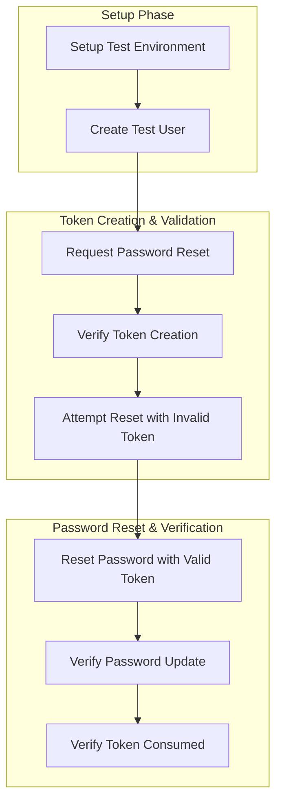

# Password Reset Integration Test Plan

## Overview

This document outlines the integration test plan for the password reset functionality, ensuring proper interaction between all system components including token management, database updates, and email notifications.

## Test Environment Setup

1. Configuration:
   - Use `@SpringBootTest` for full application context
   - Configure test database
   - Configure test email service
   - Set up necessary test utilities

2. Test Data:
   - Create test user using TestUserBuilder
   - Configure initial password hash
   - Set up test email configurations

## Test Scenarios

### 1. Successful Password Reset Flow

1. Request password reset:
   - Call reset endpoint with valid email
   - Verify token is created in database
   - Verify email would be sent (using test email service)

2. Token validation:
   - Retrieve token from database
   - Verify token properties (expiration, user email)

3. Password reset:
   - Submit new password with valid token
   - Verify password hash is updated in database
   - Verify token is marked as used
   - Verify confirmation email would be sent

### 2. Error Cases

1. Expired token:
   - Create token with past expiration
   - Attempt password reset
   - Verify appropriate error response

2. Used token:
   - Use valid token for password reset
   - Attempt second reset with same token
   - Verify appropriate error response

3. Invalid token:
   - Attempt reset with non-existent token
   - Verify appropriate error response

4. Rate limiting:
   - Request multiple password resets
   - Verify rate limiting is enforced
   - Verify appropriate error response

## Verification Points

1. Database State:
   - Token creation and storage
   - Password hash updates
   - Token status updates

2. Security Checks:
   - Password hash different from original
   - Token properly invalidated after use
   - Rate limiting enforced

3. Response Validation:
   - Proper error responses for invalid cases
   - Success responses for valid operations
   - Correct HTTP status codes

## Test Dependencies

1. Required Services:
   - UserService
   - PasswordResetService
   - PasswordResetTokenService
   - EmailService

2. Test Utilities:
   - TestUserBuilder
   - Database cleanup utilities
   - Test email service mock

## Implementation Notes

1. Use `@Transactional` for test methods
2. Clean database state between tests
3. Mock email service to prevent actual emails
4. Use test-specific application properties